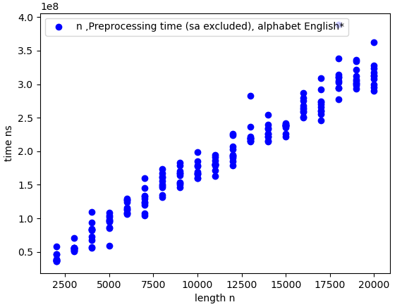
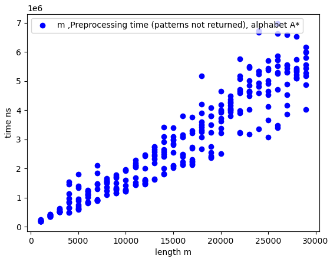

# Project 4: BWT-based matching (FM-index)

Now that you have a functioning suffix array, you should implement the BWT-based search, also known as FM-index. This algorithm improves the search in the suffix array from O(m log n + z) to O(m + z) after O(n) preprocessing (plus whatever time it takes you to build your suffix array).

You should implement a suffix array construction algorithm. You can choose to implement the naive algorithm where you explicitly sort strings, or the O(n) skew or SAIS algorithms, or any other algorithm. After constructing the suffix array, you should implement the binary search based and the Burrows-Wheeler based search algorithm.

The algorithms should be implemented in a program named `fm`. Since we are building data structures in a preprocessing step, and since a common usage of read mappers is to map multiple files of reads against the same genome, we should build the tool such that we can preprocess a genome once, and then reuse the preprocessed data on subsequent searches.

Therefore, your tool should have options for either preprocessing or read-mapping. If you run it as `fm -p genome.fa` it should preprocess the sequences in `genome.fa`, and if you run the tool as  `fm genome.fa reads.fq` it should search the genome and produce output in the same format as the previous projects.

When you preprocess `genome.fa` you should write the result to file. You are free to choose what you write to file, how many files you use, or how you represent the output. Use the input file name, here `genome.fa` but it can be any file name, to select the file names for your preprocessed data. That way, when you run a search with `fm genome.fa reads.fq`, your tool can determine which preprocessed files to read from the second first argument.

## Evaluation

Once you have implemented the `fm` program (and tested it to the best of your abilities) fill out the report below, and notify me that your pull request is ready for review.

# Report

## Preprocessing

In the preprocessing file we have 3 types of entries. The first entry marked by '>' is the name of the genome. The second entry is marked by '@' and it is the last column in the burrow-wheeler matrix, bwt. After this we write each entry from the C array, which is the accumulated buckets of the suffix array. Now each new entry is written on a new line in the file and is marked by '\*', where the first symbol following '\*' marks the symbol in the suffix array this is followed by an integer value indicating the starting position of the symbol in the suffix array.
We do not create the O table as it would still require order n time to reconstruct and it is roughly as fast to build directly from the bwt.

## Insights you may have had while implementing the algorithm

We never really considered that preprocessing and by saving some intermediate result to a file for later use could be of benefit and faster use when read-mapping or for any other algorithms for that matter.

## Problems encountered if any
We had some problems with managing which files to use and how to make the testserver agree with us. When we wrote directly to the file we got in preprocessing as os.Args[2] we would overwrite all the files used on the testserver meaning that our own program would find matches while all the reference algorithms would recieve empty files due to them being overwritten. When we made some specific file: "temp.fa" it would continously be overwritten on the testserver such that only the final test passed. The final solution was to create a new file named similar to Args[2] but just adding "zz" to the filetype (so from genome.fa we generated a new file genome.fazz) which seems a bit silly :S

## Validation

We ran the our fm algorithm and an old algorithm (from handin 2) on the some dataset with a couple of hundreds identical outputs. We then sorted the two results and compared them. 
Then in order to find edgecases we also tested the algorithm on some smaller simple genomes/reads speically constructed.
Finally we made our usual test where we run the algorithm on random strings from some different alphabets (DNA, AB, English) and verify that all reported matches are matches, and all other instances are not matches.

## Running time
We have not checked the running time of our suffix array construction algorithm as it is the same as the one we used in project 3. The time measured is then expected O(n) preprocessing.

We also made a benchmark where we did the preprocessing and then plotted the time it would take for the algorithm to find all matches, which is expected to be O(m) + the time it takes to locate and output the actual results O(z). We excluded the part where we print the z matches in this test to see if the search time would run linear in m.

